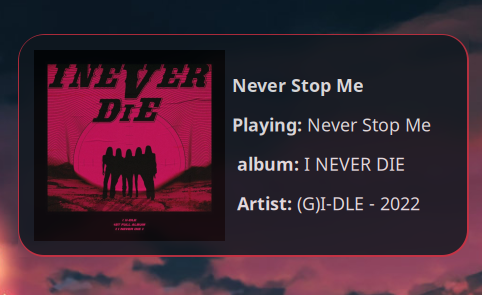

# cmus-notify: This program is a cmus status notification tool written in Rust, which can be easily configured and used for different purposes. It provides notifications for track changes, status changes, volume, playing mood and more

> **Note:** This project is still in its early stages and is not yet ready for production use. It is currently being developed as a just-for-fun project. If you are interested in contributing, please feel free to open an issue or a pull request.

## Installation

- You can install the latest release from [crates.io][crates.io] using `cargo install cmus-notify`
- You can also install the latest version from the git repository using `cargo install --git https://github.com/anas-elgarhy/cmus-notify`
- Or if you use Arch Linux, you can install the [AUR package][aur package] using your favorite AUR helper. e.g. `yay -S notify-cmus`

## Usage

- Run `cmus-notify` in your terminal to start the program, the program will run in the background and will notify you about cmus status changes
- You can also run `cmus-notify --help` to see the available options, also you can see the available options in the [usage](./docs/usage.md)
- You also have the ability to configure the program using a configuration file, you basically have the same options as the command line arguments, but you can also use the configuration file to set the default values for the command line arguments, the default configuration file path is `~/.config/cmus-notify/config.toml`, you can also use the `--config` option to specify a custom configuration file path, the default config file will be created in `~/.config/cmus-notify/config.toml` if it doesn't exist
- The recommended way to use the program is to run it in the background when you start the `cmus` music player, you can do that by creating an alias for `cmus` in your shell configuration file, e.g. `alias cmus="cmus-notify --link & cmus"`, the `--link` option will link the `cmus-notify` process to the `cmus` process, so when you close `cmus` the `cmus-notify` process will also be terminated

## Development

- This project is written in Rust, so you need to have Rust installed on your system, you can install Rust using [rustup](https://rustup.rs/)
- This project, like most Rust projects, uses `cargo` as the build system. But to make my life easier I decided to use [just][just] as a task runner, so you need to install `just` using `cargo install just`

### Just tasks

- To build the project, run `just build` in the debug mode with all the features enabled
- To build the project in the release mode, run `just build--release` with all the features enabled
- To build and run the project, run `just run`, this will build the project in the debug mode and run it with the debug log level
- You can use `just c`, to run `cargo check` with all the features enabled
- You can use `just t`, to run `cargo test` with all the features enabled
- You can use `just show-help`, to show the help message for the `cmus-notify` program
- You can use `just coverage-report`, to generate a coverage report for the project, and open it in the default browser, the report will be generated in the `target/coverage` directory, this task requires [grcov][grcov] to be installed on your system

> You can see the all the available tasks and aliases in the [justfile](./justfile), or by running `just --list`

[crates.io]: https://crates.io/crates/cmus-notify
[aur package]: https://aur.archlinux.org/packages/notify-cmus/
[just]: https://github.com/casey/just
[grcov]: https://github.com/mozilla/grcov
